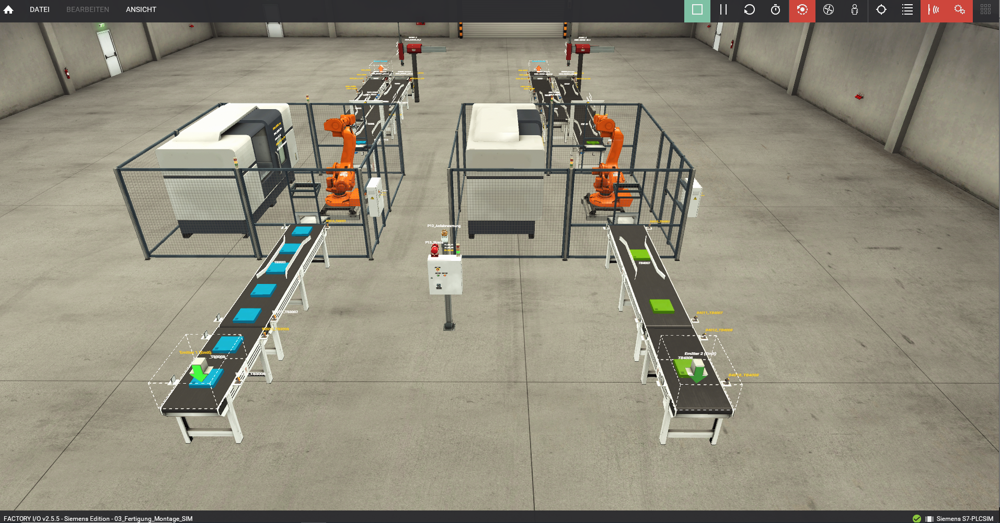
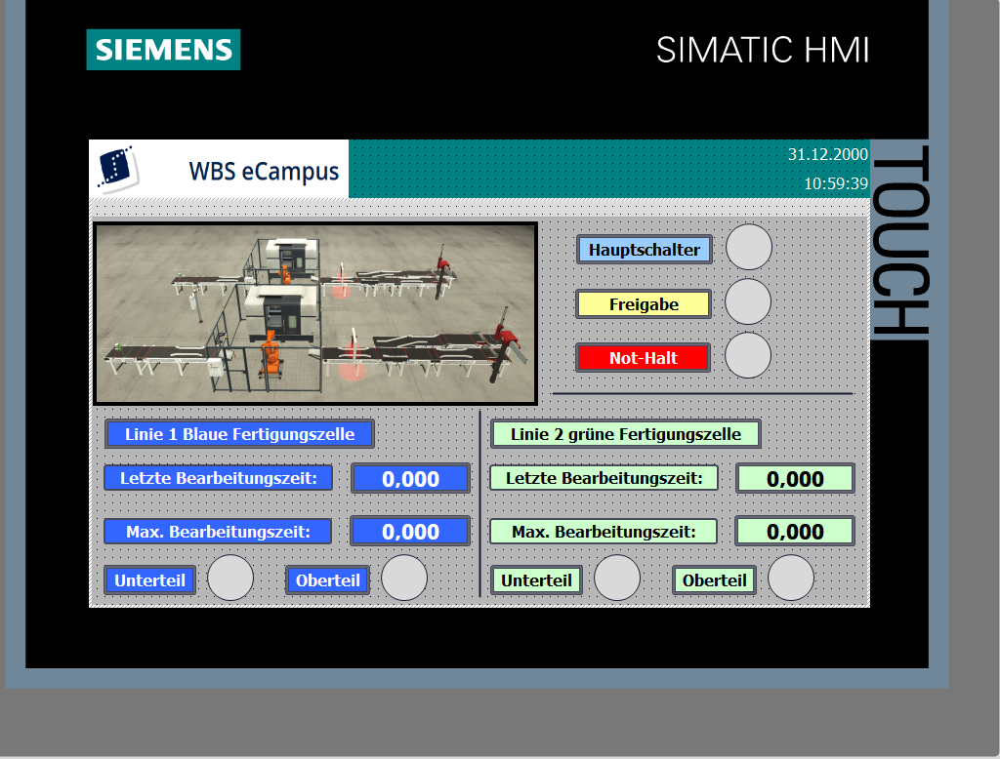
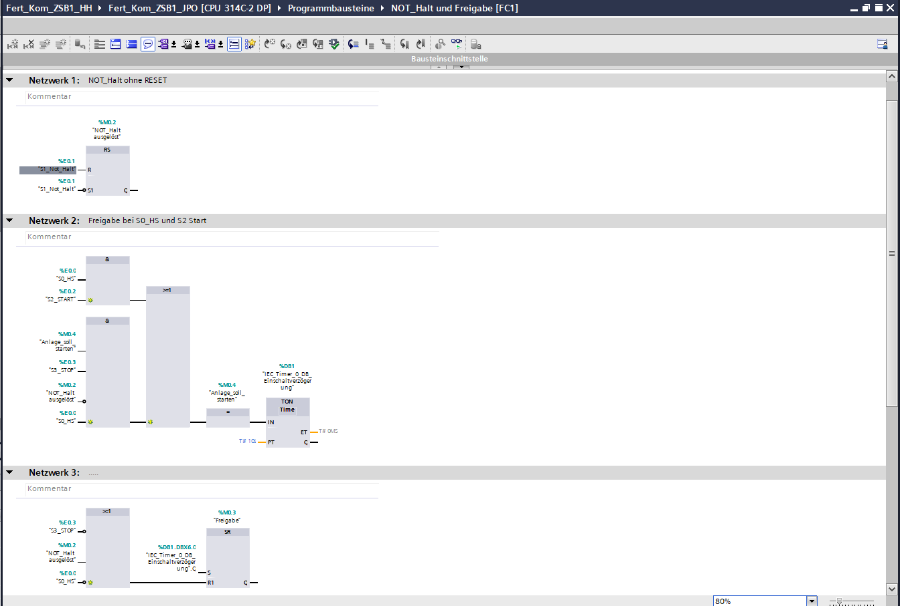

# Fertigungs- und Montageanlage

## Beschreibung
Automatisierte Fertigungs- und Montageanlage, umgesetzt mit Siemens TIA Portal (S7-300).

## Funktionen
- Steuerung von Ober- und Unterteilen
- Pick-and-Place Montageprozess
- Start/Stop und Not-Halt
- Anlaufwarnung (Sirene und Rundumleuchte)

## Technologien
- TIA Portal
- S7-300
- WinCC Advanced
- Factory IO

## Hinweis
Projekt im Rahmen der Weiterbildung umgesetzt.

## Screenshots

### Anlage (Factory IO)

### HMI (WinCC)

### Programm (TIA Portal)

